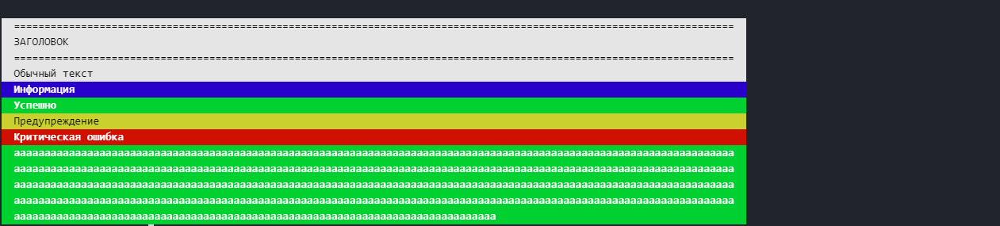
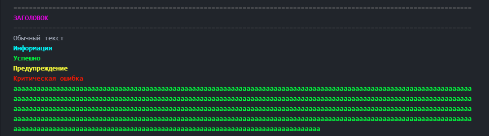

#ConsoleColor

Небольшой класс, который помогает расрасить текст консольного приложения на php.

## Быстрый старт.
### Установка.
С помощью composer:
`composer require "w1575/console-color @dev"`

###Использование:
```php
use w1575\ConsoleColor;

$console = new ConsoleColor('invert', 120);  
//  Пока что есть только 2 темы: default и inert. По-умолчанию используется (ВНЕЗАПНО!) default.
// Второй параметр - максимальная длина строки. используется для переноса длинных строк
$console->title('Заголовок');
$console->text('Обычный текст');
$console->info('Информация');
$console->success('Успешно');
$console->warning('Предупреждение');
$console->danger('Критическая ошибка');
```

Скриншоты:






